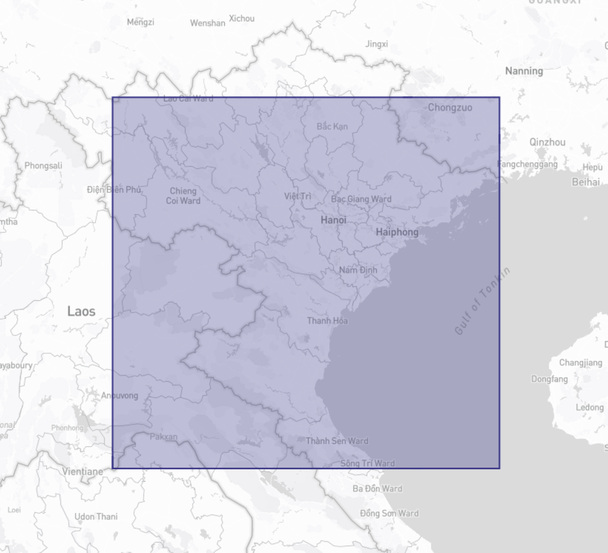
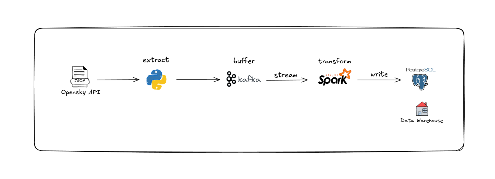

# Flight Airspace Density Tracker

Pipeline streaming theo dõi mật độ máy bay trong không phận miền Bắc Việt Nam và khu vực lân cận theo thời gian thực, sử dụng **Kafka** làm hàng đợi đệm và **Apache Spark Structured Streaming** để xử lý và tổng hợp dữ liệu theo Kiến trúc Medallion (Bronze → Silver → Gold).

---

## 1. Mô tả dự án

Dữ liệu vị trí máy bay theo thời gian thực chỉ cho biết 1 lát cắt tại 1 thời điểm - không có sẵn lịch sử. Để trả lời câu hỏi "Mật độ không phận tại khu vực thay đổi như thế nào theo thời gian?", cần liên tục thu thập và tích lũy dữ liệu theo dòng thời gian.

Dự án xây dựng pipeline thu thập dữ liệu này liên tục, xử lý theo thời gian thực, và tổng hợp số lượng máy bay xuất hiện trong khu vực theo từng khung giờ mỗi ngày.



Bounding box mặc định: khu vực miền Bắc Việt Nam và khu vực lân cận (`lamin=18, lomin=103, lamax=22.5, lomax=108`).

---

## 2. Nguồn dữ liệu

**[OpenSky Network API](https://opensky-network.org/)** - endpoint `All State Vectors`, xác thực qua OAuth2 (client credentials).

Trường dữ liệu sử dụng:

| Trường | Mô tả |
|---|---|
| `event_time` | Nhãn thời gian chụp dữ liệu (tự tạo thêm) |
| `icao24` | Địa chỉ ICAO 24-bit (Mã định danh duy nhất của máy bay) |
| `callsign` | Mã chuyến bay |
| `origin_country` | Quốc gia đăng ký máy bay |
| `longitude`, `latitude` | Tọa độ |
| `altitude` | Độ cao khí áp (mét) |
| `on_ground` | Trạng thái ở mặt đất |
| `velocity` | Vận tốc (m/s) |

---

## 3. Kiến trúc & luồng dữ liệu



### Các tầng dữ liệu (Medallion Architecture)

- **Bronze** (`bronze_flights`): dữ liệu thô, append-only, giữ nguyên mọi snapshot thu thập được.
- **Silver** (`silver_transform`): loại bỏ trùng lặp (`icao24` + `event_time`), lọc bản ghi thiếu/không hợp lệ (tọa độ ngoài phạm vi, độ cao/vận tốc âm, `callsign` rỗng).
- **Gold**: (`gold_density_by_hour`): số lượng máy bay unique theo từng khung giờ trong ngày.

---

## 4. Công nghệ sử dụng

<div align="center">

| Thành phần | Công nghệ |
|---|---|
| Ngôn ngữ | Python |
| Message queue | Apache Kafka |
| Xử lý stream | Apache Spark |
| Cơ sở dữ liệu | PostgreSQL |
| Xác thực nguồn dữ liệu | OAuth2 client credentials (OpenSky)|

</div>

---

## 5. Cấu trúc thư mục

```
Flight/
├── .env                    # Thông tin cấu hình kết nối và API key.
├── .gitignore
├── requirements.txt
├── schema.sql              # DDL tạo bảng bronze_flights
├── config.py                # đọc .env, cấu hình Kafka/Postgres/OpenSky
├── producer.py               # lấy data OpenSky, gửi vào Kafka
├── main_streaming.py          # Spark Structured Streaming: Kafka → Bronze
├── transform_silver.py         # Bronze → Silver 
├── analysis_gold.py             # Silver → Gold
└── checkpoints/                  # Spark streaming checkpoint 
```

---

## 6. Hướng dẫn cài đặt

### 6.1. Yêu cầu hệ thống

- Python 3.12
- Java 17 (bắt buộc cho PySpark)
- PostgreSQL 

```bash
sudo apt update
sudo apt install openjdk-17-jdk postgresql -y
java -version
```

### 6.2. Cài Python packages

```bash
python -m venv env
source env/bin/activate
pip install -r requirements.txt
```

### 6.3. Tạo Kafka cluster (Confluent Cloud)

1. Tạo tài khoản tại [confluent.cloud](https://confluent.cloud) 
2. Tạo 1 Kafka cluster (Basic)
3. Tạo 1 topic (ví dụ `flights_data`)
4. Tạo API Key/Secret cho cluster, lấy Bootstrap server URL

### 6.4. Đăng ký OpenSky OAuth2 client credentials

Thực hiện các bước theo hướng dẫn tại [OpenSky Network API docs](https://openskynetwork.github.io/opensky-api/) để lấy `client_id`/`client_secret` (tăng hạn mức truy vấn so với tài khoản ẩn danh).

### 6.5. Tạo database & bảng PostgreSQL

```bash
sudo -u postgres psql -c "CREATE DATABASE flight_db;"
sudo -u postgres psql -d flight_db -f schema.sql
```

### 6.6. Cấu hình `.env`

Điền đầy đủ thông tin cấu hình kết nối và API key:

```
OPENSKY_CLIENT_ID=...
OPENSKY_CLIENT_SECRET=...

KAFKA_BOOTSTRAP_SERVERS=...
KAFKA_API_KEY=...
KAFKA_API_SECRET=...
KAFKA_TOPIC=flights_data

POSTGRES_HOST=localhost
POSTGRES_PORT=5432
POSTGRES_DB=flight_db
POSTGRES_USER=postgres
POSTGRES_PASSWORD=...
```

Kiểm tra kết nối tới PostgreSQL và Kafka:

```bash
python config.py
```

---

## 7. Vận hành

### 7.1. Chạy pipeline lần đầu / hàng ngày

Mở **2 terminal riêng biệt**, chạy song song và để chạy liên tục:

```bash
# Terminal 1 - thu thập dữ liệu liên tục, mỗi 30 giây
python -m scripts.producer
```

```bash
# Terminal 2 - xử lý stream, ghi vào Bronze, mỗi 30 giây
python -m scripts.streaming
```

Dừng bằng `Ctrl+C` ở cả 2 terminal khi cần tạm nghỉ. Dữ liệu đã ghi được giữ nguyên; chạy lại vào lần sau sẽ tiếp tục tích lũy (append), không mất dữ liệu cũ - miễn không xóa thư mục `checkpoints/`.

### 7.2. Chạy tầng Silver và Gold

Sau khi đã tích lũy đủ dữ liệu (khuyến nghị để `producer.py`/`streaming.py` chạy tối thiểu vài giờ để có đủ nhiều khung giờ khác nhau):

```bash
python -m scripts.transform
python -m scripts.analysis
```

Mỗi lần chạy, Silver và Gold sẽ được overwrite lại dựa trên toàn bộ dữ liệu Bronze hiện có.

### 7.3. Reset dữ liệu để chạy lại từ đầu

```bash
sudo -u postgres psql -d flight_db -c "TRUNCATE TABLE bronze_flights RESTART IDENTITY;"
rm -rf checkpoints/
```

---

## 8. Hướng phát triển tiếp theo

- Thêm dashboard trực quan hóa đữ liệu
- Airflow orchestration để tự động hóa lịch chạy Silver/Gold
- Mở rộng bounding box hoặc thêm nhiều khu vực theo dõi song song
- Sử dụng dbt để quản lý transform Silver/Gold thay cho PySpark script thuần